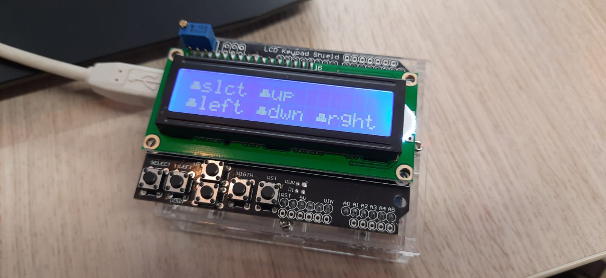

# LCD with Buttons

 

## Parts:
* Arduino UNO (or any that fits the LCD Keypad Shield)
* [LCD Keypad Shield](https://www.vanallesenmeer.nl/Webwinkel-Product-45245717/LCD-Keypad-Shield.html?gclid=Cj0KCQjwjN-SBhCkARIsACsrBz5SC2GWLB6N5cI0CU2-TK0wTyPSsfNiERr11nEiYvxBqZZODIjkoGsaAtDPEALw_wcB)
Any lcd could work but without the button presses

## Setup:
1. Attach the LCD Keypad Shield to the top of the arduino
1. Change the settings in settings.h
    * `LCD_COLS` to the amount of columns your display has
    * `LCD_ROWS` to the amount of rows your display has
    * `LCD_RS`, `LCD_EN`, `LCD_D4`, `LCD_D5`, `LCD_D6`, `LCD_D7` and `LCD_BUTTONS` to the correct pins
1. Upload the sketch
1. Press some buttons :)
